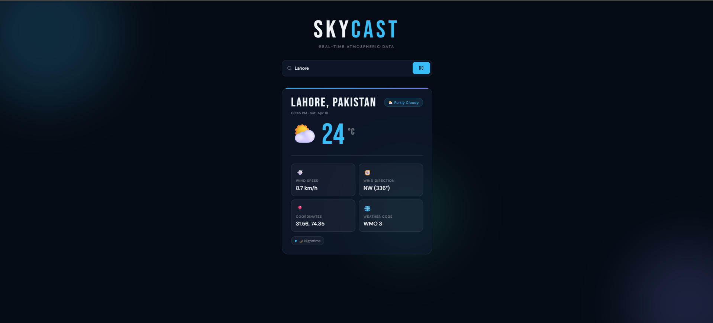

# 🌤️ Skycast — Weather App

A clean, minimal weather app that gives you live atmospheric data for any city in the world.

## 🌐 Live Demo
[Click here to view](https://samiullah-2004.github.io/skycast-weather-app/)

## ✨ Features
- Search any city worldwide
- Live temperature, wind speed & direction
- Weather condition with emoji icons (clear, cloudy, rain, snow etc)
- Day / Night indicator
- Animated dark UI with floating orbs
- Fully responsive on mobile and desktop
- No API key required

## 🛠️ Built With
- HTML
- CSS (animations, dark theme, glassmorphism)
- JavaScript (async/await, API integration)
- Open-Meteo Weather API (free, no key needed)
- Open-Meteo Geocoding API

## 📸 Screenshot

